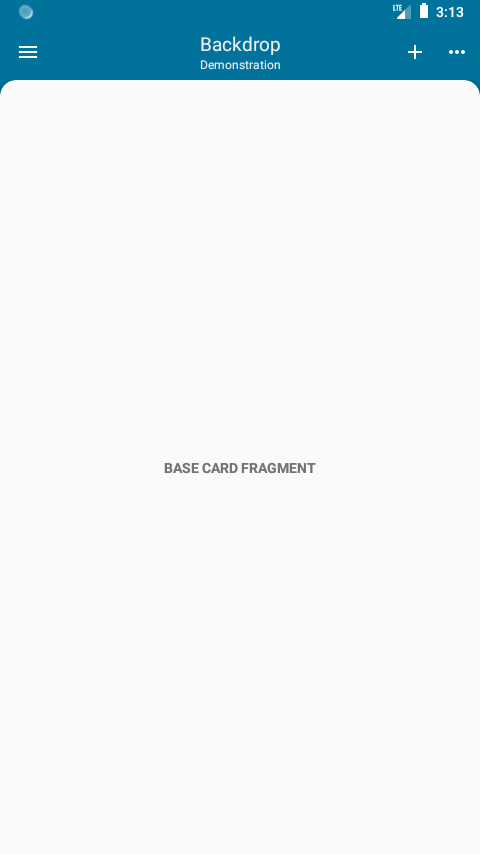
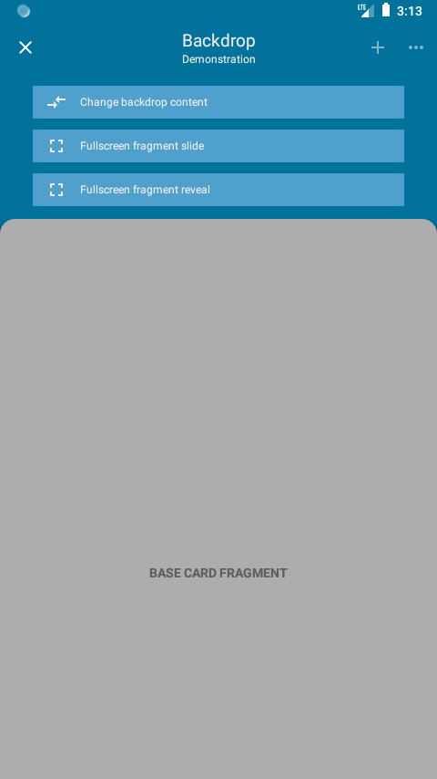
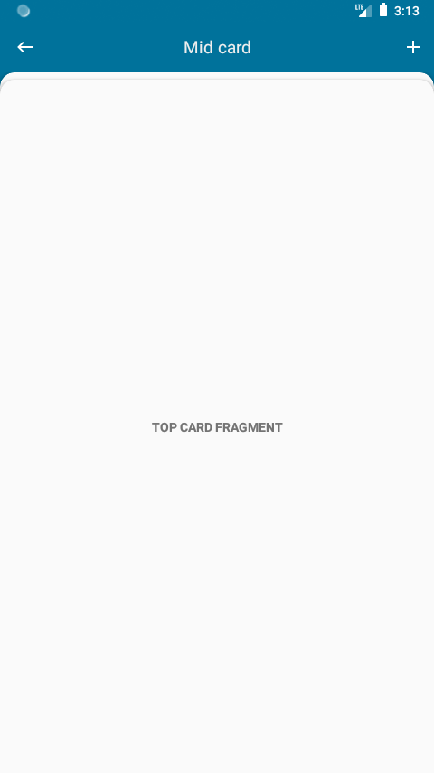

[](https://jitpack.io/#Str3l0k/Backdrop_Android)

# Backdrop for Android
This project is an approach to create a template for Backdrop UI design on Android.
Backdrop means that the toolbar moves into the background and the navigation drawer is no longer the main source for navigation.
Instead the card stack element holds the navigation steps and can reveal additional options or configurations in the backdrop element.

# Usage
The app shows hows to use it for now as demonstration. 
It is intended as One-Activity-Application with Fragments for all other means.
Basically use the Activity as base class.

To build an application based on backdrop, the first step is to implement an Activity which
inherits from the Activity provided in the library. It is itself an modified __AppCompatActivity__.
The second step is to create a base card fragment which will be used as main entry point.

So the basic configuration for an working app is one activity and one Fragment.

__MainActivity__
```kotlin
class MainActivity : Activity() {
    override val baseCardFragment: CardFragment = BaseCardFragment()
}
```

__BaseFragment__
```kotlin
class BaseCardFragment : CardFragment() {
    override val toolbarItem: ToolbarItem
        get() = ToolbarItem(
            title = "Backdrop",
            subtitle = "Demonstration",
            primaryAction = R.drawable.ic_add,
            moreActionEnabled = true
        )

    override fun onCreateContentView(
        inflater: LayoutInflater,
        container: ViewGroup?,
        savedInstanceState: Bundle?
    ): View? {
        return inflater.inflate(R.layout.base_card, container, false)
    }

    override fun onContentViewCreated(view: View?, savedInstanceState: Bundle?) {
        // configure content view here
    }
}
```

The base fragment is returned as property in the Activity and currently the only thing that is required to be 
implemented when using the Activity class. The fragment needs a __ToolbarItem__ which configures the toolbar titles and 
action items. Instead of using the *onCreateView* and *onViewCreated* from the Android __Fragment__ class use the *onCreateContentView* and
*onContentViewCreated* from the backdrop Fragment to inflate and configure the desired layout.


# Preview
<p align="center">
  
  
  
</p>

# TODO
See issues for now.

## License
Apache 2.0
