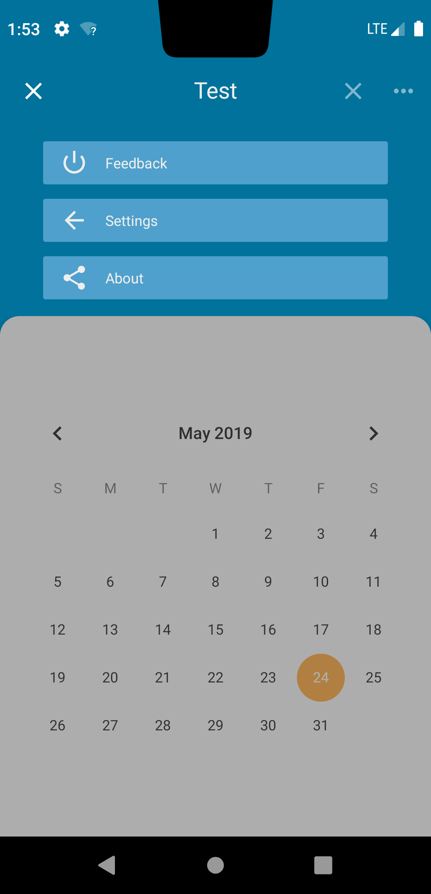
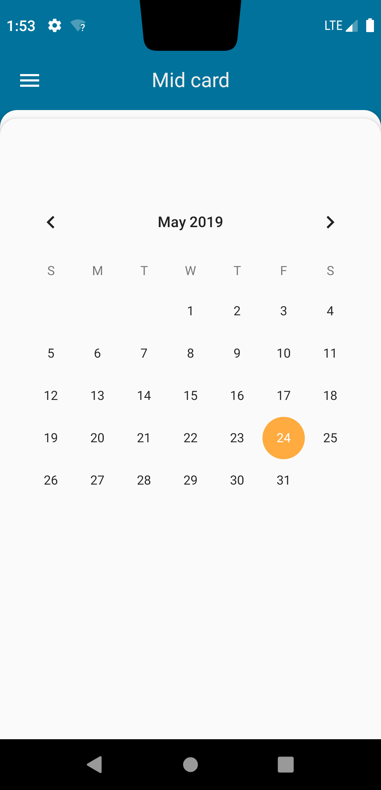

# Backdrop for Android
This project is an approach to create a template for Backdrop UI design on Android.
Backdrop means that the toolbar moves into the background and the navigation drawer is no longer the main source for navigation.
Instead the card stack element holds the navigation steps and can reveal additional options or configurations in the backdrop element.

# Usage
The app shows hows to use it for now as demonstration. 
It is intended as One-Activity-Application with Fragments for all other means.
Basically use the Activity as base class.

<b>A detailed instruction will follow shortly.</b>

# Preview

  
  

# TODO

## License
Apache 2.0
